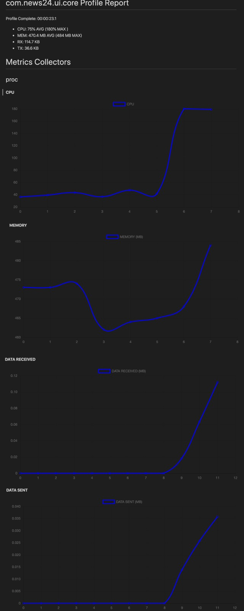

# App Performance Reporting tool

This is a simple cli that monitors basic app performance stats and generates reports on them.

The primary use case is to measure stats while you run the app (UI test) and see if any new code/feature causes changes.

## Features

- measure android and ios (simulator only)
- generate run reports
- average multiple runs (sessions)
- compare sessions

## Metrics

- cpu
- memory
- network bytes sent
- network bytes received

## Examples

### Record a Run

1. start the profiler:

   ```sh
   ts-node profiler.ts record-android PACKAGE -f OUTPUT_FOLDER

   ts-node profiler.ts record-ios APP_NAME -f OUTPUT_FOLDER
   ```

2. open the app and run through the UI test
   ```sh
   # you can see the live stats
   | cpu:43.3%(40) mem:474 MB(473.3 MB) tx:0 Bytes rx:0 Bytes  00:00:08.0
   ```
3. stop the profiler (cmd+c)

   ```sh
   Profile Complete: 00:00:23.1

    - CPU: 75% AVG (180% MAX )
    - MEM: 470.4 MB AVG (484 MB MAX)
    - RX: 114.7 KB
    - TX: 36.6 KB

   report saved to: com.news24.ui.core_2020-04-04T09:59:55_report.md

   raw data saved to: com.news24.ui.core_2020-04-04T09:59:55_data.json
   ```


4. view the report

   

### Compare Sessions

a session is a set of runs, grouped by a folder.
when comparing sessions the first is the baseline and second (or multiple) are the experiemnts / variations

**for example:**
comparing an app with out ads to an app with ads enabled

```sh
ts-node profiler.ts session-compare sessions/ios/clean sessions/ios/ads
```

will output:

## sessions/ios/ads

- **uses 62.86% more CPU (26% vs 70%)**
- **uses 44.77% more Memory (169.8 MB vs 307.5 MB)**
- **received 86.97% more Data (1.7 MB vs 12.9 MB)**
- **sent 91.51% more Data (82.3 KB vs 968.6 KB)**
- **uses 32.88% more Data (1.8 MB vs 2.6 MB)**
